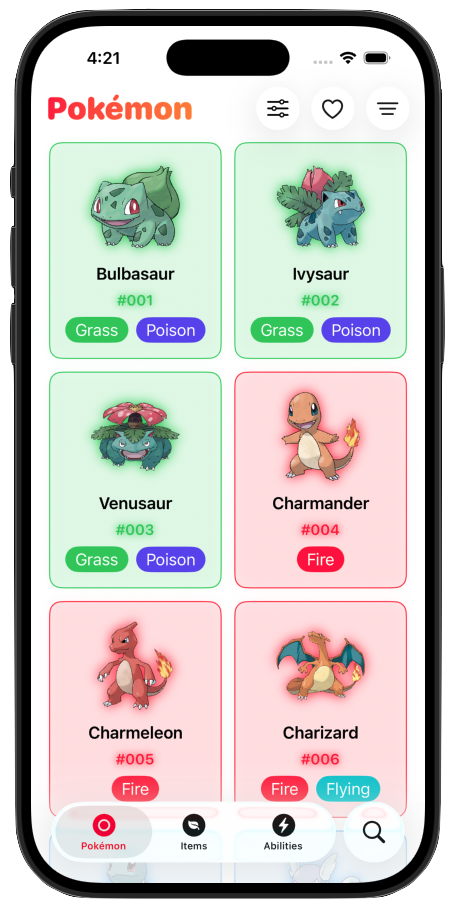
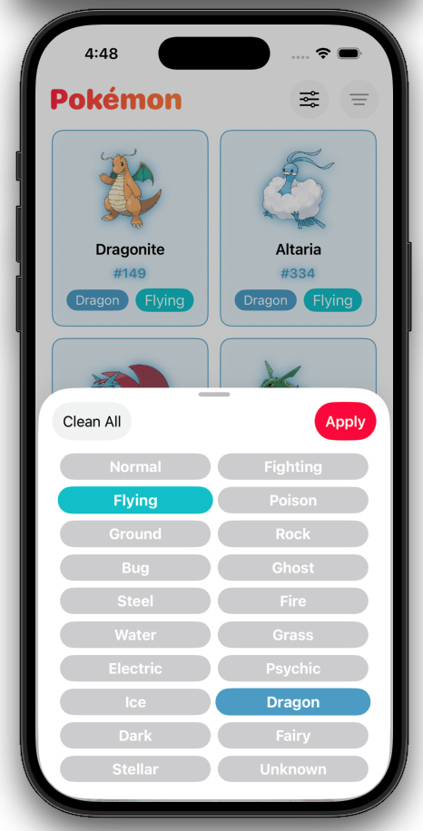
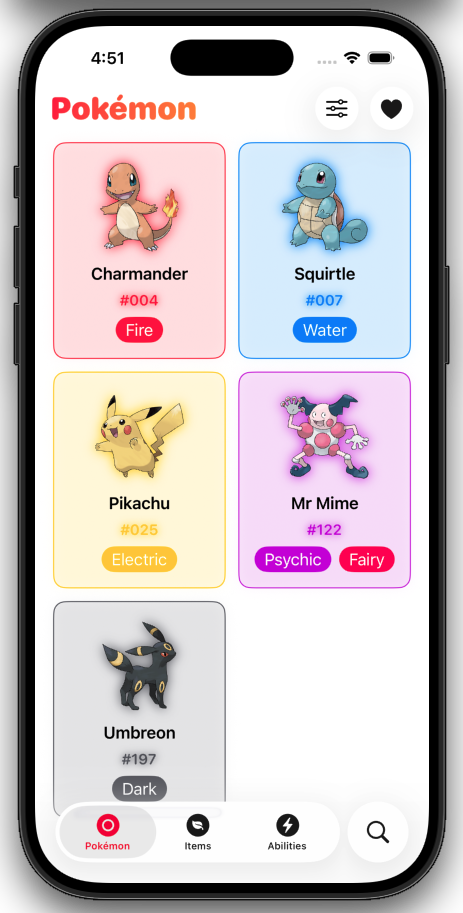
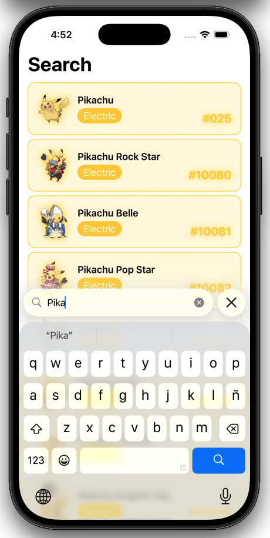
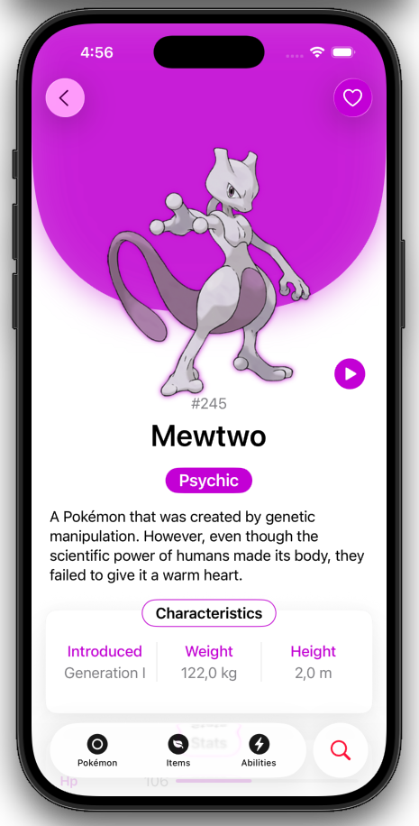
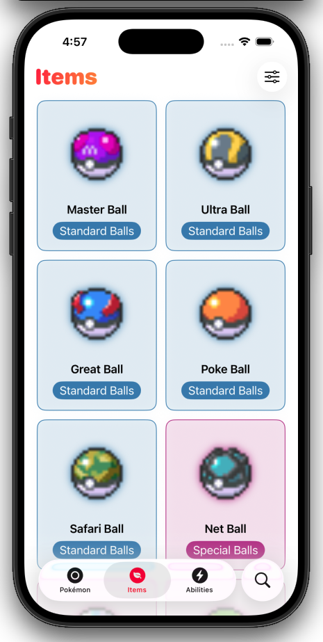
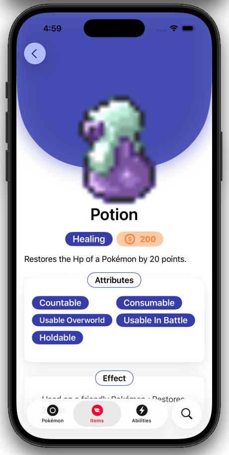
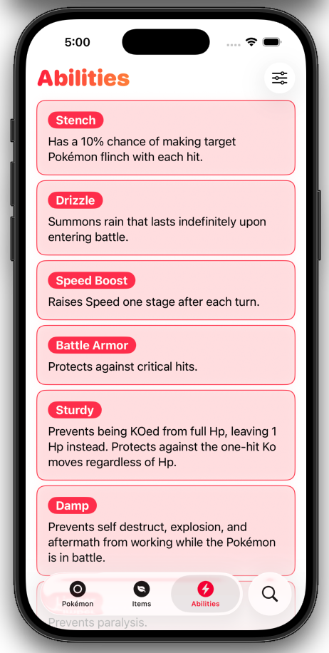
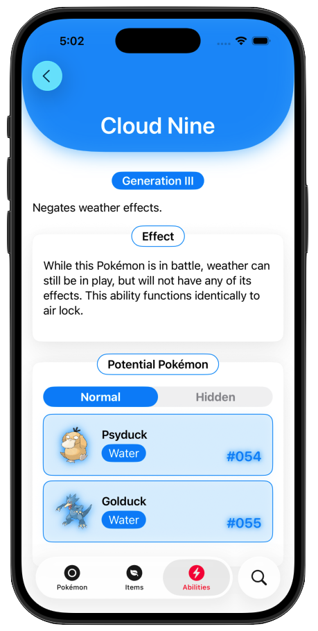

# 📘 Pokémon Dex

Pokémon Dex is a fully modular iOS application built with **SwiftUI**, designed as a personal architecture-driven project to consume the official **PokéAPI** through its **Swift wrapper library**.

The app allows users to explore **Pokémon**, **Items**, and **Abilities**, featuring advanced navigation, dynamic layouts (Grid/List), filtering, favorites, reusable components, and a clean scalable architecture built with modern Swift concurrency.

This project was developed with a strong focus on **clean architecture, modularization and scalability**.

---

## ✨ Core Features

### 🐾 Pokémon
- Browse Pokémon in **Grid or List mode**
- Search Pokémon by name
- Filter Pokémon by type
- Add / remove Pokémon from favorites
- Persistent favorites storage
- Detailed modular Pokémon view including:
  - Characteristics
  - Stats
  - Abilities
  - Capture info
  - Breeding info
  - Held items
  - Evolution chain
  - Alternative Forms

### 🎒 Items
- Browse items in **Grid or List mode**
- Search items
- Detailed modular item view including:
  - Attributes
  - Effects
  - Related Pokémon

### ⚡ Abilities
- Browse abilities in **Grid or List mode**
- Search abilities
- Detailed modular ability view including:
  - Effect descriptions
  - Related Pokémon

---

## 🧠 Technical Highlights

- Fully modular architecture by feature
- Clean separation: `App / Core / Features / Shared`
- MVVM with centralized `ViewState`
- Decoupled navigation with `AppRouter` + `NavigationRouter`
- Async/Await concurrency
- `actor` usage for thread-safe favorites persistence
- Generic services using protocols
- Reusable paginated and searchable ViewModels
- Dynamic layout persistence (Grid / List)
- Centralized `DataProvider`
- Error handling abstraction with `ErrorHandleable`
- Structured documentation with MARKs and DocC style
- Scalable design ready for new features

---

## 🧩 Architecture Overview

The app follows a **strict modular feature-based architecture**:

- Each feature (Pokémon, Item, Ability) is self-contained.
- Shared UI components are centralized.
- Core logic is abstracted and reusable.
- Navigation is completely decoupled from views.
- Views only mutate state — ViewModels control logic.

### Navigation Flow

1. `MainTabView` controls tabs and global search.
2. Each feature maintains its own navigation stack.
3. `AppRouter` coordinates between features.
4. `NavigationRouter` manages per-feature navigation state.
5. `NavigationContext` determines the active router based on selected tab.

This ensures:
- No navigation stack conflicts.
- Stable search navigation.
- Independent feature stacks.

---

## 🛠 Tech Stack

| Category | Tools / Technologies |
|-----------|----------------------|
| Language | Swift 6 |
| Framework | SwiftUI |
| Architecture | MVVM (Feature Modularized) |
| Concurrency | async/await |
| State Management | ViewState |
| Navigation | Custom Router Architecture |
| Persistence | Local storage (Favorites + Layout) |
| Networking | PokéAPI Swift Wrapper |
| API Source | https://pokeapi.co |
| IDE | Xcode |
| Target Platform | iOS |

---

## 🌐 API Integration

Data is fetched from the official **PokéAPI** using its Swift wrapper library.

🔗 https://pokeapi.co

The app does **not directly call raw endpoints**, but instead consumes the structured wrapper, ensuring cleaner models and safer networking.

---

## 🎨 UI & UX Highlights

- Dynamic colors based on Pokémon types
- Dynamic colors based on item categories
- Smooth transitions and consistent animations
- Modular section-based detail screens
- Reusable card components
- Adaptive Grid / List layout system
- Persistent layout preference
- Consistent UI components grouped by responsibility

---

## 📸 Screenshots

### 🐾 Pokémon

<p align="center">
  
  
  
</p>

<p align="center">
  
  
</p>

---

### 🎒 Items

<p align="center">
  
  
</p>

---

### ⚡ Abilities

<p align="center">
  
  
</p>

---

## 🗂 Project Structure

```plaintext
PokemonDex/
│
├── App/                               # App entry point, global configuration and tab setup
│   ├── Configuration/                 # Global UI appearance and URL cache configuration
│   ├── MainTabView.swift              # Root tab container managing navigation context
│   └── PokemonDexApp.swift            # Application entry point
│
├── Core/                              # Shared core layer (protocols, routing, providers, base models)
│   ├── Extensions/                    # Core-level shared extensions
│   ├── Models/                        # Global app models (ViewState, AppTab, NavigationContext, etc.)
│   ├── Protocols/                     # Generic abstractions (Paging, Search, IdentifiableResource, etc.)
│   ├── Providers/                     # Centralized dependency access (DataProvider)
│   ├── Routing/                       # AppRouter & NavigationRouter (decoupled navigation system)
│   └── Services/                      # Core shared services (e.g. layout persistence)
│
├── Features/                          # Modular feature-based domains
│   ├── Ability/                       # Ability domain (extensions, models, services, viewmodels, views)
│   ├── Item/                          # Items domain (extensions, models, services, viewmodels, views)
│   └── Pokemon/                       # Pokemon domain (extensions, models, services, viewmodels, views)
│
└── Shared/                            # Reusable UI components, utilities and abstractions
    ├── Components/                    # UI building blocks grouped by responsibility
    │   ├── Controls/                  # Buttons, segmented controls, presentation menus
    │   ├── Layout/                    # Card containers, headers, layout helpers
    │   ├── Media/                     # Async image handling (URLImage + ViewModel)
    │   ├── Navigation/                # NavigationContainer abstraction
    │   ├── State/                     # ViewState handling utilities
    │   └── Text/                      # Typography and text-based UI components
    │
    ├── Extensions/                    # Shared Swift extensions (String, View, Image, etc.)
    ├── Mocks/                         # Mock factories for previews and testing
    ├── Screens/                       # Reusable shared screens (SearchView, InfoStateView)
    ├── Services/                      # Generic resource service abstraction
    ├── UI/                            # Shared UI configuration and layout enums
    │   └── Layout/                    # Grid/List layout definitions
    └── ViewModels/                    # Reusable pagination and search view models
```

The structure enforces **clear boundaries**, making the app easy to scale without refactoring existing features.

---

## 📚 Documentation

Full documentation available here:

[](https://dsantiagg.github.io/Pokemon-Dex/documentation/pokemon_dex)

---

## 🚀 Why This Project Exists

Pokémon Dex was built to:

- Practice consuming external APIs in a scalable way
- Implement a professional modular architecture
- Master advanced SwiftUI navigation patterns
- Apply modern Swift concurrency
- Build reusable, production-level components
- Create a clean and extensible foundation for future features

---

## 🔮 Future Improvements

- Offline caching layer
- Unit testing coverage
- UI snapshot testing
- Deep linking support
- Region / Moves / Generations modules
- Performance optimizations for large datasets

---

## 👤 Author

**David Santiago Girón Muñoz**

- 🐙 GitHub: [DSantiagG](https://github.com/DSantiagG)  
- 🐦 X (Twitter): [@DSantiagG](https://x.com/DSantiagG)  
- 💼 LinkedIn: [David Giron](https://www.linkedin.com/in/dsantiagg/)

---

⭐ If you like the project, feel free to star the repository.
